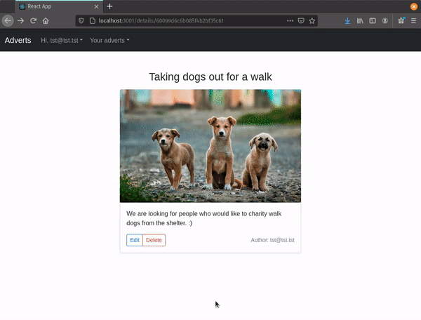
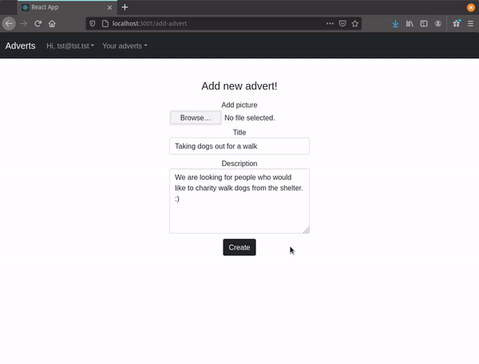
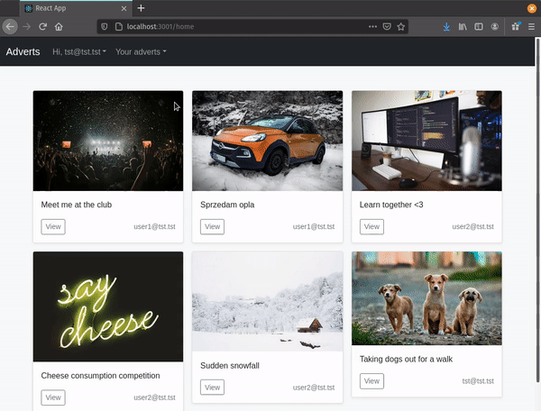

# Adverts-React
 Adverts-React is an frontend ReactJs application that we prepaired to pass the React subject. It works with the [Adverts-express-api](https://github.com/dancesWithMachines/adverts-express-api) which is also a part of the subject.
 
 ## Table of contents
 
* [What does it do](#what-does-it-do)
* [Main features](#main-features)

## What does it do
Adverts-React is written in ReactJs and is using additional libraries. It's a simple market-place that shows advertisments. It support user accounts, so everyone that is registered and logged can add, view, modify and delete their adverts. Non registered users are allowed just to display adverts. It has additional features like: dynamicaly updated navbar and allerts allerts.

## Main features

### User accounts
App supporst user accounts. It allows user to register, login and delete account if it is needed. Beeing an user is required to use all features conected with creating, modyfying etc. adverts. When user is logged in, their data is stored in sesssion. Navbar is also dynamicaly rendered to provide user interface.

### Home page
App has the home page that is accessible for all users. Advert owners have additional features.

### CRUD
Adverts-React supports all api CRUD methods linked to the adverts.

Access to user interface requires beeing owner of an advertisment

Deleting account also removes all user posts (but that's an api's feature)

Users have feature to see just their adverts

